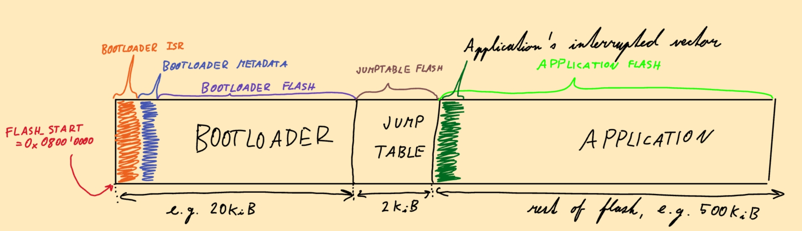

# VoMi's CAN Bootloader

Developed and maintained by Vojtěch Michal (Discord `vojtechmichal`)<br/>
since season 2020/2021 at eForce (FEE) Prague Formula.

Our custom solution for flashing ECU firmware over vehicle CAN buses designed because...
- SWD is not ergonomic as it requires fragile STlink and LEMO programming cable (of which we have limited number).
- Many ECUs in miniature casings do not have a LEMO connector and connecting an STlink requires extraction from vehicle and full disassembly.
- Built-in ST bootloader has very limited capabilities, primarily it does not support all (FD)CAN peripherals in the MCU.

### Resources
- See [Bootloader submodule setup](#⚙️-bootloader-submodule-setup) for instructions how to make your application bootloader aware.
- See [Communication protocol](#communication-protocol) for description of the BL CAN protocol and internals. This information is not intended for casual user, but hackers could enjoy it.
- For a documentation how to interact with the bootloader using python on a PC, refer to [**Can-tools**](https://eforce1.feld.cvut.cz/gitlab/fse/can-tools), file `bootloader.py`. This python script is used for all bootloader related operations and contains help that should answer all your questions.
- Gitlab … https://eforce1.feld.cvut.cz/gitlab/vomi/bootloader
- CANdb … https://eforce1.feld.cvut.cz/candb/units/116 (located in Accessory)

## 🏛️ Key STM32 architecture facts

Far more information is present in the Programmer's manual and Reference manual for each MCU. Many facts are shared for the whole ARM Cortex M3/4/7 architecture, many are specific to each chip family (STM32F1/F2/F4/F7/G4).

- For STM32 the native word size is 32 bits; this is the size of (function) pointers. However, the flash memory may require higher write granularity (e.g. 64 bits, i.e. two neighboring words on STM32G4).
- The **interrupt vector** (or **interrupt table** or similar interchangeably used word) is a contiguous array of function pointers - addresses of interrupt handlers (a.k.a. interrupt service routines, ISRs).
	- Each interrupt is assigned a unique number (index). When an interrupt is generated, the hardware accesses the table element at this index to load address of interrupt handler.
	- The array base address is controlled by the System Control Block register `SCB->VTOR` (Vector Table Offset Register). Its default value is 0x0800'0000, unless changed using option bytes (currently not done by any eForce ECU except for FSE09 STW; that is however not using BL).
	- Element 0 is the end of the stack address fetched by the CPU to initialize stack pointer `sp` after reset.
	- Element 1 is the reset handler used to initialize the program counter `pc`.
	- MCU boot process: When the CPU is reset (e.g. powered-up), it fetches the end of stack from element 0 (0x0800'0000 by default), loads the program counter from element 1 (0x0800'0004 by default) and starts executing instructions.
## 🗿 Bootloader design philosophy:
- BL should know as little as possible about application
	- the BL should be operational even without flashed/working application (e.g. in case of fatal application failure to prevent the MCU from getting bricked).
	- the BL should require minimal information about the application, only what is necessary for its operation.
- Application should know as little as possible about BL. The app should not recognize whether it was invoked from the BL or not.
	- keep all peripherals in reset state when jumping to app.
	- require minimal repository changes to make the app work with or without the BL.
- Do not waste memory:
	-  be reasonably small to leave as much FLASH for application as possible
	-  use only a single backup domain register to keep state between software resets.
## 📖 Key Bootloader facts and glossary
- There are two separately compiled programs - the **bootloader** (abbreviated **BL**) and the **application** (abbreviated **app** or equivalently the **firmware** or **FW**)
	- The application firmware contains all application logic and has the ability to jump into the bootloader by software reset.
	- The bootloader manages metadata in memory to check the existence of application firmware in flash memory and jumps to it if valid. 
	- If app is not valid or the BL was explicitly requested, it initializes (FD)CAN peripherals and starts listening for **transactions** - strictly delimited sequences of messages exchanged between master and slave to achieve some particular task. The bootloader supports the following types of transactions:
		- **Flashing / Bootloader update** - The bootloader downloads new firmware or BL code from the flashing master and stores it the 		target's flash memory.
		- **Firmware / Bootloader dump** - Reverse process when current contents of target's flash memory are dumped into a .hex on the PC
		- **Set entry point** - Only updates the JumpTable to new address of firmware vector table. Useful when app was flashed over SWD and we only need to make the BL recognize it.
- FLASH Memory map:<br>Names written in capital letters around the memory map correspond to memory region names in linker scripts. 
	- Bootloader resides at the start of flash 0x0800'0000 (or in general at the reset value of SCB->VTOR loaded from the option bytes), it provides its own interrupt table (reset handler, CAN interrupts, etc.). The compiled program `Bootloader.elf` defines contents of three memory areas:  (the BL vector table, <span style="color:orange">orange in picture</span>), `BootloaderMetadata` (the BL software build, build time and date etc, <span style="color:#4040ff">blue in picture</span>), and `BootloaderFlash` (actual .text and load for .data of BL code, <span style="color:#8040ff">purple in picture</span>). Roughly 20 KiB in total.
	- At the end of `BootloaderFlash`, the section `JumpTableFlash` (<span style="color:#964b00">brown in picture</span>) is located. **Application jump table** contains magic values to prevent memory corruption, the address of application's entry point and interrupt vector and some auxiliary data for dumping such as list of logical memory blocks. It is updated during transactions to store firmware's metadata. It is a single no-init global instance of `struct ApplicationJumpTable` stored on a separate page (typically 2 KiB); it must be possible to erase it independently of the application and the bootloader.
	- The rest (most) of the flash memory belong to the memory area `ApplicationFlash` (<span style="color:#00ff00">green in picture</span>), where the actual application firmware (e.g. AMS.elf or Disruptor.elf) resides.

- **(Boot) Target** = Bootloader-aware ECU designated by a unique id listed in [CANDb enum](https://eforce1.feld.cvut.cz/candb-dev/enum-types/130). In the context of transactions, it is the slave ECU running the bootloader.
- **(Flashing) Master**: CAN bus node which sends commands and data to the Target. Currently only a computer with connected Ocarina, maybe the DV computer some day.
- **Physical memory block**: Generalization of **flash sectors** or **pages**, i.e. a contiguous flash address range that is erased by a single command. All physical memory blocks may or may not have the same size depending on MCU family, therefore available physical memory blocks are abstracted away by **PhysicalMemoryMap** when communicating with the master.
- **Logical memory block**: Contiguous address range containing bytes of the firmware. There may be multiple logical blocks when the compiler skips some bytes e.g. due to padding or alignment of memory sections. Logical memory blocks may (and do in reality) span across physical memory block boundaries. Bytes between logical memory blocks are zeroed by the current implementation of writing flash, but this behavior should not be relied on.
- **Bus master**: At any time, either the master or the bootloader is the bus master. The bus master initiates a subtransaction within a transaction, sends messages and receives acknowledges from the other node. The current bus master can **yield communication** in order to pass the bus control to the other unit and make it the new bus master. Implemented using message `CommunicationYield`. Visualize this as a token passing mechanism.

- **(Flash) Transaction**: The whole process of flashing. Starts when the master sends first Transaction magic and ends by writing new application jump table to target's flash.
**Transaction magic**: Special 32bit value used to initiate important subtransactions of the flashing process. The value is 0x696c6548 (the result of 32bit little-endian access on a string buffer containing the string „Heli“).

## Multiple simultaneously active bootloaders
Bootloader transactions always target only one bootloader. If multiple bootloaders are present on the same CAN bus (normal state ni the vehicle), note that:
- All bootloaders will transmit their `Beacon` and `SoftwareBuild` to signal their presence. Since all Beacons and all SoftwareBuilds share the same ID, this may result in collisions on the bus. However, considering the low frequencies, there was no problem in 5 years.
- Messages `Data` and `DataAck` do not contain the `Target` field to save space (and maximize useful bandwidth). They are used only after a transaction with a concrete target has been started using `Handshake` and `HandshakeAck`. When a bootloader receives these messages without starting a transaction before, they are ignored.
- All other messages `Handshake`, `HandshakeAck`, `CommunicationYield`, `ExitReq`, `ExitAck`, `Ping`, `PingResponse`, (and `Beacon` and `SoftwareBuild`, but they are not used to carry out transactions) contain field `Target`. Bootloaders ignore any such message when its ID does not match the message's `Target`.
- `Ping` and `PingResponse` and used to discover new bootloaders on the bus, so master may rapidly transmit them to all available targets. Yet again, there is a theoretical chance of collision, but it has never manifested significantly.

## ⚙️ Bootloader submodule setup

This section will lead you through the process of making your ECU bootloader-aware (See [Target microcontrollers](#target-microcontrollers) for currently supported MCUs).

Whenever unsure, check my (VoMi's) reference implementations in [AMS](https://eforce1.feld.cvut.cz/gitlab/ctu24/ams-sw), [Disruptor](https://eforce1.feld.cvut.cz/gitlab/fse/disruptor-sw) or [PDL](https://eforce1.feld.cvut.cz/gitlab/ctu24/pdl-sw/) (the following guide is based on AMS implementation). Do not worry to ask on Discord 🙋.

Make sure you meet these requirements:
	- You are able to modify your linker script.
	- UFSEL is already a submodule of yours and you use `UFSEL/Assertion` and `UFSEL/BitOperations`.


1) Add this repository as submodule to the root of your firmware. Unless you have very specific needs, place the submodule directory into the repository root. To ensure the submodule is found by CI, either manually edit `.gitmodules` to use relative path or specify `GIT_SUBMODULE_FORCE_HTTPS: "true"` in your `.gitlab-ci.yml` (see [Gitlab Docs](https://docs.gitlab.com/ci/runners/configure_runners/#rewrite-submodule-urls-to-https))
```bash
$ cd ecu-sw # The root of firmware repository where CMakeLists.txt is located
$ git submodule add ssh://git@eforce1.feld.cvut.cz:2020/vomi/bootloader.git

# If needed, manually edit .gitmodules and change path to relative like this:
# [submodule "bootloader"]
#    path = bootloader
#    url = ../../vomi/bootloader.git
```
**CHECKPOINT**: You may commit and push the repository. If your CI pipeline does not fail when cloning the submodule, you have done it correctly.

2. Modify CANdb (always prefer `candb-dev`).</br>Two actions will be needed, one in the bootloader specification and one in your unit. In case your unit does not normally transmit CAN messages, lacks CANdb definition or there is anything else that would hinder you from proceeding, consult it with someone experienced.
	1. Navigate to unit `Accessory::Bootloader` [link](https://eforce1.feld.cvut.cz/candb-dev/units/116), open enumeration `BootTarget` [link](https://eforce1.feld.cvut.cz/candb-dev/enum-types/130) and choose an identifier from existing constants
			(those currently include AMS, PDL, DRT, FSB etc), or add a new constant.
	2. Make sure the list of Buses on the overview page of `Accessory::Bootloader` contains
			all buses listed in the overview page of formula generation (package) your unit belongs to. For example when adding
			BL to a unit affiliated with CTU25, make sure that the bootloader contains reference to
			both `CTU25 - CAN1` and `CTU25 - CAN2`.
	3. Edit your unit: add message `Ping` owned by `Accessory::Bootloader` to received messages and add `PingResponse` to sent messages.
	4. **CHECKPOINT**: Generate C code for your unit and check that header/source files contain the definition of `Bootloader_Ping` and `Bootloader_PingResponse`. Generate JSON v2 for your package and check that it contains the unit `Bootloader` in package `Accessory`.
	5. Manually update the CANdb generated code in `can_XXX.c` to send the message `Bootloader_PingResponse` to the bus where we last received `Bootloader_Ping`. You should change 2 locations as follows:
```cpp
int Bootloader_send_PingResponse_s(const Bootloader_PingResponse_t* data) {
	// ...
	int rc = txSendCANMessage(Bootloader_Ping_get_rx_bus(), Bootloader_PingResponse_id, buffer, sizeof(buffer));
	return rc;
}
```
3.  Modify your `CMakeLists.txt`: add `bootloader/API/BLdriver.cpp` to the list of compiled sources for the project. If you did not place `bootloader` into repo root, modify your include path such that `#include <bootloader/API/BLdriver.hpp>` works.
```cmake
# CMakeLists.txt

set(SRC
	# ... Other sources

	bootloader/API/BLdriver.cpp

	# CANdb/can_AMS.c

	# AMS/main.cpp
	# BSP/gpio.cpp
	# ... Other sources

	)
```

4. Modify the CMake toolchain file(s) (i.e. files with extension `.cmake`) to define macro `BOOT_STM32x`, where `x` represents your MCU family, e.g. `G4`. This macro need not have a value as only its presence/absence is tested.
```cmake
# toolchain.cmake

# ...
SET(DEFINES "-DSTM32G474 -DSTM32G474xx -DBOOT_STM32G4 -DTX_WITH_CANDB=1 -D__weak='__attribute__((weak))' -D__packed='__attribute__((__packed__))'")
# ...
```
5. Include bootloader API linker scripts in your application's linker script. Reference implementation is as follows:
```cpp
// linker_script.ld

/* ... */

INCLUDE ../../bootloader/API/bootloader-aware-memory-map-stm32g4.ld
INCLUDE ../../bootloader/API/bootloader-aware-memory-map-shared.ld

/* Specify the memory areas */
MEMORY
{

	FLASH_Firmware (rx)        : ORIGIN = ORIGIN(ApplicationFlash), LENGTH = LENGTH(ApplicationFlash) /* - memory reserved for other mechanisms, e.g. CANEPP*/
	/* ... */
}

 /* ... */
}
```
6. Modify application code. Your firmware will interact with the flash master using messages `Ping` and `PingResponse`.
	1. If you use CAN filters, allow `Ping` through (should be done automatically thanks to `candb_received_messages`).
	2. Implement logic similar to the reference example below. After reception of `Ping` with matching `Target`,
		respond with `PingResponse` and reset into BL if requested. You may consider refusing to enter the bootloader when critical processes running in your FW (e.g. active TS, active motor control). To reboot into the bootloder use function `boot::resetTo(destination)` with destination `boot::BackupDomain::magic::bootloader`.
	3. (Optionally) Hook your `SystemInit` fault handler to jump into the bootloader with destination `boot::BackupDomain::magic::app_fatal_error`. This is a safe fallback
		in the case of repeated application malfunction. Information about the failure will propagate though
		the bootloader to flash master (connected PC).
	4. Ensure there are no conflicting writes to `SCB->VTOR` (done e.g. by some HAL library) as they may interfere with bootloader's operation. Consult any occurrence with another experienced programmer.
```cpp
// e.g. in main.cpp

//...
#include <bootloader/API/BLdriver.hpp>
//...

struct BootloaderDriver {
	//TODO modify this identifier to match the name of unit you want to make bootloader-aware
	constexpr static Bootloader_BootTarget thisUnit = Bootloader_BootTarget_AMS;

	static void sendBootloaderPingResponse(bool bootloader_pending) {
		Bootloader_PingResponse_t msg;
		msg.Target = thisUnit;
		msg.BootloaderPending = bootloader_pending;

		//wait for both peripherals to have an empty mailbox (ping response is transmitted to both buses in this case.
		for (; !can.hasEmptyMailbox<1>() || !can.hasEmptyMailbox<2>(););
		send(msg);
	}

	static int pingReceivedCallback(Bootloader_Ping_t* data) {
		if (data->Target != thisUnit)
			return 1; //Ignore bootloader requests targeted at someone else

		if (!data->BootloaderRequested) { //Bootloader is not requested ... the master only polls connected units
			debug_printf(("AMS: BL ping received.\r\n"));
			sendBootloaderPingResponse(/*bootloader_pending=*/false);
			return 0;
		}

		//TODO add your application specific logic here - prevent entering the bootloader during critical operations
		if (!airs.tsIdle()) { //Refuse to enter the bootloader when AIRs are closed.
			sendBootloaderPingResponse(/*bootloader_pending=*/false);
			debug_printf(("AMS: Refused to enter BL during critical process (closed AIRs).\r\n"));
			return 1;
		}
		sendBootloaderPingResponse(/*bootloader_pending=*/true);


		//TODO perform cleanup tasks, terminate all ongoing processes. The software is going to shut down.
		can.FlushSerialOutput();
		can.FlushBuses(/*timeout=*/100_ms);

		boot::resetTo(boot::BackupDomain::magic::bootloader);
	}
};

// Optional: Report bootloader metadata to stdout during application initialization
void dump_bootloader_metadata() {
	debug_printf_0("Bootloader metadata at address 0x%08x\r\n", reinterpret_cast<std::uint32_t>(&boot::bootloaderMetadata));
	debug_printf_0("    Magics %s\r\n", boot::bootloaderMetadata.are_magics_valid() ? "OK" : "NOT OK");

	if (!boot::bootloaderMetadata.are_magics_valid())
		return;

	debug_printf_0("    Working tree %s\r\n", boot::bootloaderMetadata.has_dirty_working_tree ? "dirty" : "clean");
	debug_printf_0("    Commit hash 0x%08x\r\n", boot::bootloaderMetadata.commit_hash);
	debug_printf_0("    Build date %s\r\n", boot::bootloaderMetadata.build_date);
	debug_printf_0("    Build time %s\r\n", boot::bootloaderMetadata.build_time);
}

int main() {
	// initialization_code
	dump_bootloader_metadata();

	Bootloader_Ping_on_receive(BootloaderDriver::pingReceivedCallback);
	// ... more initialization code

}

```


7. **CHECKPOINT**: You should be good to go! 🎉 After successful compilation, disassemble the binary
	and check that the isr vector is not located at `0x0800'0000` but rather several KiB above the start of flash memory.
	STM32G4 bootloader reserves 24 KiB of memory (therefore the application isr vector should be located at 0x0800'6000).


## 🛠️ Building the bootloader binary

In repository root:
- Run `python compile.py --all` to build all targets (more than 20; it may take some time, good for development).
- Run `python compile.py CAR ECU`, e.g. `python compile.py CTU25 AMS` to build one specific configuration.

Configurations for various ECUs (MCU family, CAN pinout, etc.) are stored directly in `compile.py`.

### Flashing

The bootloader is a standalone binary located in the flash memory beside the application firmware. It is flashed by standard means of SWD, make sure that you **NEVER PERFORM A MASS ERASE** of MCU's flash memory.

## Target microcontrollers

Each target MCU is defined using the following (an example for STM32G4):
- Memory map defined in the linker script `API/bootloader-aware-memory-map-stm32g4.ld`. This file is included by both the bootloader and the application firmware to share definitions of addresses and memory regions.
- Linker script `stm32g4.ld` used to compile the BL firmware.
- CMake toolchain file `stm32g4.cmake` that - among others - provides preprocessor definitions to control conditional compilation:
	- `BOOT_STM32G4` selects appropriate implementation of drivers (CAN, FLASH, GPIO etc.)
	- `BUILDING_BOOTLOADER` indicates to `API/BLdriver.hpp` and `API/BLdriver.cpp` that the file is compiled as part of BL firmware. This is important to properly set up members of `BootloaderMetadata` etc.

Currently the primary target is STM32G4(74) - the common MCU selected for CTU24 and CTU25.
Support for MCUs other than G4 was dropped from `compile.py` but the code still exists. Some work would be required to restore the support for other platforms (e.g. increase the reserved memory space).

In old eForce (until FSE12), the Bootloader was ported to STM32F105, STM32F205, STM32F405, STM32F412 and STM32F767; these ports still exist in the codebase, but are currently disabled as they do not compile (mostly due to insufficient memory allocated in old linker scripts). A lot of improvements have been introduced since FSE12 that were not tested on older MCU families, so G4 is currently the only reliably supported target. Other ports are straight forward to
add as the whole project is focused on maximal extensibility.

## Communication protocol
The communication protocol uses messages `Handshake` and `Data` and their corresponding ACKs. For every sent `Handshake`, a corresponding ack must be awaited before proceeding to make sure the system performed requested operation. `Handshake` messages usually carry information in fields `Register` and `Value` or `Register==Command` and `Command` fields. Message `CommunicationYield` is used to pass the bus-master role between nodes. <br>
**Note on notation**: Elementary steps in the description below will be prefixed by either **H** or **D** to make it clear which message shall be used to perform it. Furthermore, a letter **B** or **M** is present to indicate the transmitter of given message (Bootloader vs Master).

Transaction prerequisite: The target bootloader is in state Ready. If it's not (e.g. because previous transaction crashed or unexpectedly ended), it must be reset via asserting the bit `Force` in message `ExitReq`.

The following section describes the "writing" transactions when either the firmware or the bootloader is updated. "Reading" transactions are exact opposites and hence are not described in here.

### Overview of transactions flashing / BL update
1. M via H: The master writes to the `TransactionMagic` register
2. M via H: The master chooses the type of transaction by sending `Command` `StartTransactionFlashing` or `StartBootloaderUpdate`.
	1. Bootloader sends the map of physical memory (see [Transmission of physical memory map](#transmission-of-physical-memory-map))
	2. Firmware/BL memory map is transmitted by the master  (see [Reception of logical memory map](#reception-of-logical-memory-map))
	3. Physical memory blocks are chosen and erased  (see [Physical memory block erassure](#physical-memory-block-erassure))
	4. Firmware/BL is downloaded (see [Firmware download](#firmware-download))
	5. Bootloader receives firmware/BL metadata (see [Firmware metadata](#firmware-metadata))
3. M via H: The master writes to the `TransactionMagic` to indicate the end of transaction

### Transmission of physical memory map
The bootloader needs to inform the flash master about the size and structure of target device memory.
During this phase, the **master verifies** that the flashed firmware/BL memory map is covered by physical memory available on the device.

1. Master yields.
2. B via H: The bootloader transmits the transaction magic to indicate the start of subtransaction
3. B via H: The bootloader transmits the number of available physical memory blocks `n`.<br> Repeat `n` times:
	1. B via H: The bootloader transmits the starting address of next physical memory block
	2. B via H: The bootloader transmits the size of next physical memory block
4. B via H: The bootloader transmits the transaction magic to indicate end of subtransaction
5. Bootloader yields.

### Reception of logical memory map
The flash master informs the bootloader about the logical memory map of the application firmware / new BL binary. Successive blocks shall not overlap and have increasing addresses. During this phase, the **bootloader verifies** that the flashed firmware/BL memory map is covered by physical memory available on the device. If the check fails, BL aborts the transaction.

1. M via H: The master transmits the transaction magic to indicate the start of subtransaction
2. M via H: The master transmits the number of logical memory blocks `n`<br> Repeat `n` times:
	1. M via H: The master transmits the starting address of next logical memory block
	2. M via H: The master transmits the size of next logical memory block
3. M via H: The master transmits the transaction magic to indicate end of subtransaction

###  Physical memory block erassure
The flash master commands the bootloader to erase individual chosen physical memory blocks (flash pages/sectors). This way both sides know precisely which blocks of memory are available and may perform sanity and transaction integrity checks.

1. M via H: The master transmits the transaction magic to indicate the start of subtransaction
2. M via H: The master transmits the number of physical memory blocks to erase `n`<br> Repeat `n` times:
	1. M via H: The master transmits the starting address of physical memory block. Bootloader erases it
1. M via H: The master transmits the transaction magic to indicate end of subtransaction

### Firmware / BL download
The flash master sends words of firmware / BL binary one by one to the bootloader. Firmware is flashed in order of strictly increasing addresses; in case some address is missing (the message got lost on CAN or in Ocarina), the bootloader sends command `RestartFromAddress` to restart transmission from the specified address. This way both sides are responsible for the firmware/BL integrity

1. M via H: The master transmits the transaction magic to indicate the start of subtransaction
2. M via H: The master sends the size of flashed binary <br> Repeat for each logical memory block of firmware binary:
	1. M via D WITHOUT ACK: Master streams data as a series of data messages.
1. B via DataAck: Bootloader acknowledges successfull reception of whole firmware.
2. M via H: The master sends checksum of the written firmware
3. M via H: The master transmits the transaction magic to indicate end of subtransaction

### Firmware / BL metadata
The flash master tells the bootloader, where to find the firmware's entry point and isr vector.

1. M via H: The master transmits the transaction magic to indicate the start of subtransaction
2. M via H: The master sends the address of the interrupt service routine table address
3. M via H: The master sends the entry point address
4. M via H: The master transmits the transaction magic to indicate end of subtransaction


##  Scratchpad
VTOR alignment: Programming manuals of stm32f1+f2 (Cortex M3), stm32f3+f4 (Cortex M4) and stm32f7 (Cortex M7) all agree that the interrupt vector shall be aligned to the smallest power of two capable of holding all isr addresses and which is not smaller than 128words (==512 byte). Therefore I suppose that this requirement holds reasonably well for all stm32f MCUs.

Bootloader on Cortex M0: VTOR is missing! For solution see this article. It is possible to redirect all irqs to a single Bootloader handler which then uses the SCB→ICSR to determine irq number and redirects control to either real isr vector of the bootloader or isr vector of the application.